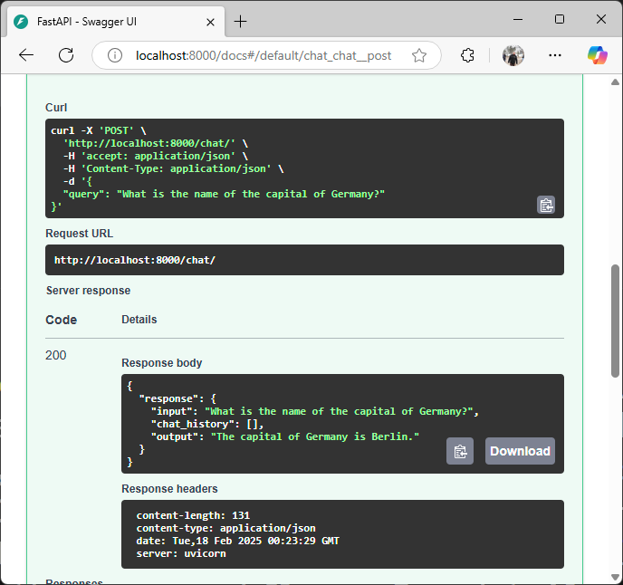

# Ollama Chat Agent 🚀



  
A lightweight conversational agent powered by **LangChain**, **Ollama**, and **FastAPI**. This project provides an interactive chat API using **Llama3** as the language model.

## 📝 Features
- 🔥 **Conversational AI**: Uses `Llama3` for text-based interactions.
- 🛠 **LangChain Agent**: Implements a LangChain-powered conversational agent.
- ⚡ **FastAPI Backend**: Provides an efficient REST API for chat queries.
- 🛠 **Extensible Tooling**: Includes an example `echo_tool` that can be expanded.
- 🖥 **Docker-Ready**: Easily containerized for deployment.

---

## 🚀 Quick Start

### 1️⃣ Clone the Repository
```bash
git clone https://github.com/TamerOnLine/tameronline-ollamachatagent.git
cd tameronline-ollamachatagent
```

### 2️⃣ Install Dependencies
Ensure you have Python 3.9+ installed, then run:
```bash
pip install -r requirements.txt
```

### 3️⃣ Run the FastAPI Server
```bash
uvicorn main:app --host 0.0.0.0 --port 8000 --reload
```

### 4️⃣ Test the API  
Use **cURL** or **Postman** to send a chat request:

```bash
curl -X POST "http://127.0.0.1:8000/chat/" -H "Content-Type: application/json" -d '{"query": "Hello, how are you?"}'
```

Expected JSON response:
```json
{
    "response": "Hello! How can I assist you today?"
}
```

---

## 🛠 Project Structure
```
tameronline-ollamachatagent/
│── agent.py              # Defines the LangChain Agent with Llama3
│── main.py               # FastAPI server handling chat requests
│── requirements.txt      # Dependencies list
│── LICENSE               # MIT License
│── README.md             # Project Documentation
└── img/                  # Images or assets (if any)
```

---

## ⚡ Configuration
By default, the model used is **Llama3**. If you want to switch to another Ollama model (e.g., `mistral`), modify `agent.py`:
```python
llm = ChatOllama(model="mistral", temperature=0)
```

---

## 🛠 Extending the Agent
### Adding Custom Tools
You can extend the agent by defining new tools. Example:
```python
def reverse_tool(text: str):
    return text[::-1]  # Reverses the input text

tools.append(Tool(name="reverse_tool", func=reverse_tool, description="Reverses the input text."))
```

---

## 🐳 Docker Support
To run this project in a container:
```bash
docker build -t ollama-chat-agent .
docker run -p 8000:8000 ollama-chat-agent
```

---

## 📜 License
This project is licensed under the **MIT License**. See [LICENSE](LICENSE) for details.

---

## 📩 Contact
- **Author:** [Tamer Hamad Faour](https://www.linkedin.com/in/tameronline/)
- **GitHub:** [TamerOnLine](https://github.com/TamerOnLine)
- **Website:** [mystrotamer.com](https://www.tameronline.com/)

---

🌟 **Enjoy building with Ollama & LangChain!** 🚀

